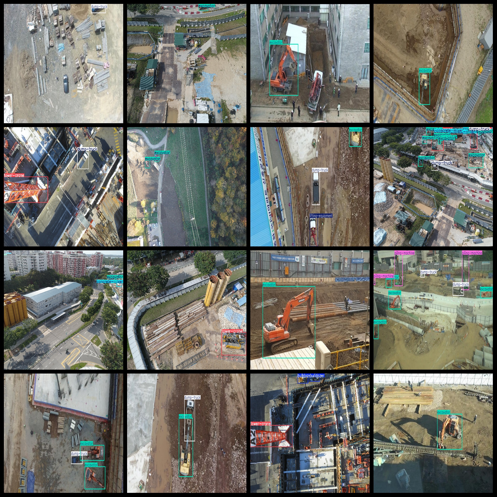

# Aerial Construction Site Engineering Vehicle Construction Machinery Dataset 927 images7-classVOC+YOLO format

The aerial construction site engineering vehicle construction machinery dataset consists of 927 images in the 7-class VOC+YOLO format. The dataset is not split into txt files with segmentation paths, but only includes jpg images and corresponding VOC format xml files as well as yolo format txt files.

Number of images (jpg file count): 927

Number of annotations (xml file count): 927

Number of annotations (txt file count): 927

Number of annotation categories: 7

Github repository: datasets_sl

Annotation category names according to the order in the labels folder's classes.txt file: ["bulldozer", "concrete-mixer", "dump-truck", "excavator", "lifting-equipment", "piling-machine", "tower-crane"]

Label Chinese translation: Bulldozer, Concrete mixer, Truck, Excavator, Lifting equipment, Piling machine, Tower crane

Number of bounding boxes per category:

Bulldozer bounding box count = 95

Concrete mixer bounding box count = 205

Dump truck bounding box count = 562

Excavator bounding box count = 959

Lifting equipment bounding box count = 52

Piling machine bounding box count = 78

Tower crane bounding box count = 290

Total bounding boxes: 2241

Number of images per category:

Bulldozer images = 62

Concrete mixer images = 133

Dump truck images = 385

Excavator images = 557

Lifting equipment images = 49

Piling machine images = 56

Tower crane images = 240

Image resolutions: Images are multi-resolution, such as 6000x4000, 960x540, etc.

Annotation tool used: labelImg

Dataset enhancement: No

Annotation rules: Draw bounding boxes for each category

Important note: The dataset does not have been split into training validation test sets; it needs to be divided by oneself.

Special declaration: This dataset does not guarantee any accuracy of the trained models or weights file.

Annotation and image situation is as follows:

## Images

---

Here is a pay link on Stripe (https://buy.stripe.com/3cs8yP7sY87d0vu9AB). Please contact me lonlonago@foxmail.com after funding $89, and I will send you a complete data files, thank you!

